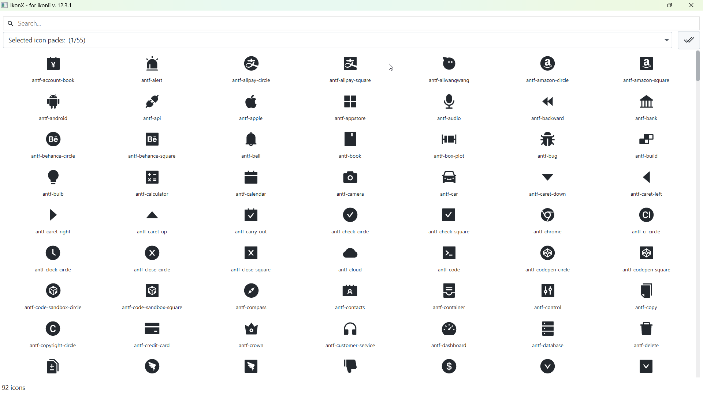
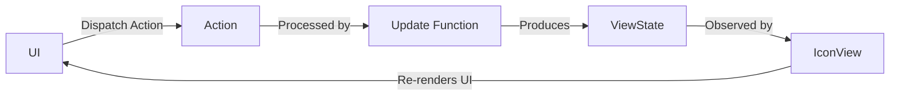

# IkonX - Icon Pack Browser

## Why IkonX Exists

Finding the right icon for your JavaFX project can be a hassle. I know the struggle. See, there are more than 45,000 icons spread across 55 different icon packs in [Ikonli](https://github.com/kordamp/ikonli). That's a lot of icon codes to comb through!

I was inspired by the [AltantaFX sampler](https://downloads.hydraulic.dev/atlantafx/sampler/download.html), which made browsing Material icons a breeze. So, I decided to take it a step further. I created IkonX - the Icon Pack Browser. With this tool, you can easily search, preview, and copy icon codes from **all** available icon packs. No more digging through endless documents to find that perfect icon.

## What IkonX Does

Here's what you can do with IkonX:

- **One-Stop Shop:** Access icons from all 55 supported icon packs in one place.
- **Quick Search:** Find icons by searching for their icon codes.
- **Preview Icons:** See what each icon looks like before you choose.
- **Copy and Paste:** Click an icon, and its code is automatically copied to your clipboard.
- **User-Friendly:** It's simple and easy to use.

## Architecture: Model-View-Update (MVU)

IkonX follows a strict Model-View-Update (MVU) architecture, enforcing **unidirectional data flow** and a **single source of truth**.

### Core Principles

1. **Single Source of Truth**: The entire application state is stored in a single `ViewState` object. The UI is a pure function of this state.

2. **Unidirectional Data Flow**: Data flows in one direction:

   * **Action**: User interactions and other events are represented as immutable `Action` objects.
   * **State**: The `Update` function takes the current `ViewState` and an `Action` and produces a new `ViewState`.
   * **View**: The `IconView` observes the `ViewState` and updates the UI accordingly.

3. **No Direct UI Mutation**: The UI is never mutated directly. All changes are the result of a new `ViewState` being emitted. The `render(ViewState)` method in `IconView` is the only place where the UI is updated.

### The Flow

1. The UI dispatches an `Action`.
2. The `Action` is sent to the `Update` function.
3. The `Update` function produces a new `ViewState`.
4. The `IconView` receives the new `ViewState` and re-renders itself.

This strict adherence to MVU results in a predictable, testable, and maintainable codebase.

## Getting Started with IkonX

1. Clone or download this repository to your computer.
2. Open it in your favorite Java development environment.
3. Build and run the IkonX app.
4. Start finding and using icons from all the packs.

## How to Use IkonX

1. Open the IkonX - Icon Pack Browser.
2. Search for icons using their icon codes.
3. Preview icons to find the perfect fit.
4. Click on an icon to select it; the code is automatically copied to your clipboard.
5. Paste the code into your JavaFX application, and you're good to go.

## Want to Help Improve IkonX?

I welcome contributions! If you want to enhance IkonX or add more features, here's what to do:

1. Fork the IkonX repository.
2. Create a new branch for your changes.
3. Make your changes and thoroughly test them.
4. Send me a pull request, explaining what you did and why it's awesome.

## Legal Stuff

IkonX is licensed under the [MIT License](https://opensource.org/license/mit/).

## Credits

- Huge thanks to the creators and contributors of the [Ikonli](https://github.com/kordamp/ikonli) library.
- Shoutout to [AltantaFX](https://mkpaz.github.io/atlantafx) for inspiring this project.

## Questions?

Got questions or suggestions? Reach out to me at [contact.kamau@gmail.com](mailto:contact.kamau@gmail.com). I'm here to help.
